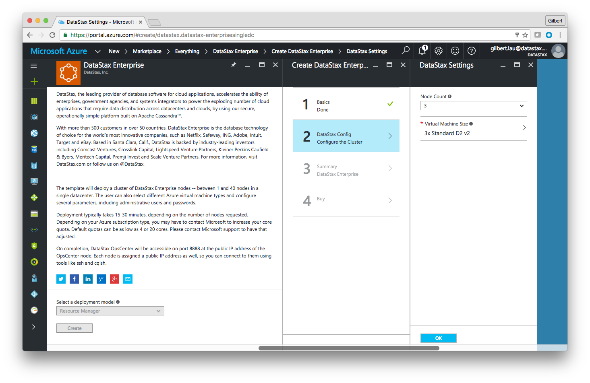
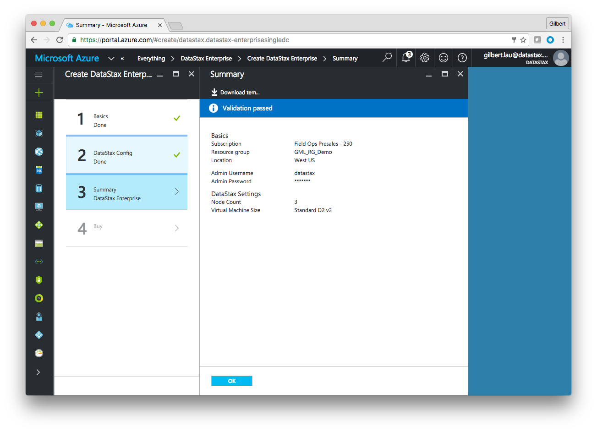
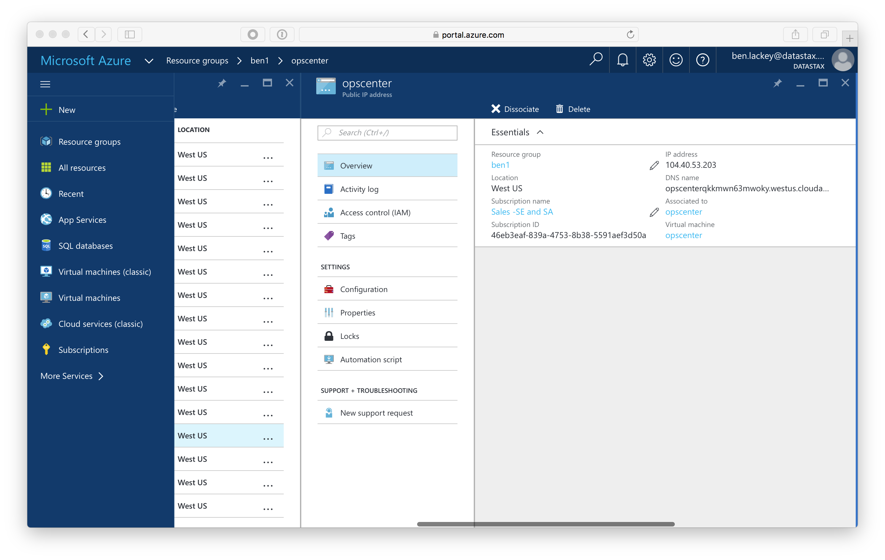

# Lab 0 - Provisioning

We are going to set up a DataStax Enterprise (DSE) cluster on Azure.  If you do not have an Azure account, you'll need to signup for one or request access from your company.  Azure offers a [$200 free trial](https://azure.microsoft.com/en-us/pricing/free-trial/) to new users.  Note that if you use a free trial you will be subject to a low core quota that restricts how many machines you can spin up.

Please complete this lab prior to the day of the event.  This lab should take less than half an hour to complete.  If you have questions, contact your Microsoft Cloud Solution Architect (CSA), Data Solution Architect (DSA) or [ben.lackey@datastax.com](mailto:ben.lackey@datastax.com)

First off, open up a web browser and go to [http://portal.azure.com](http://portal.azure.com).  This is the new Azure portal.  It replaces an older portal that Microsoft is deprecating.  Do not use the older portal for these labs.

Once you have logged in and accessed the portal, click on the Marketplace:

Type "datastax" in the search bar and hit enter.

Now click on the "DataStax Enterprise" offer.

You are presented with a new blade that shows the DataStax Enterprise offer.  There is some text describing DataStax.  There's also a pulldown that is grayed out.  This marketplace offer uses the "Resource Manager" deployment model.  Azure Resource Manager (ARM) is the newest and preferred way to deploy to Azure.  If you want to learn more about the ARM templates that underly the Azure Marketplace offer, you can learn about them [here](https://github.com/DSPN/azure-resource-manager-dse).

Click on the "create" button.

You will be presented with a new blade for basic information.  Admin username and password are the SSH user and password for your cluster.  For this lab we suggest "datastax" and "foo123!"  If you use a different user and password please take note of it because it can take some time to reset them.

For "Resource group" type in the name of a new group.  If you use an existing group you may experience name collisions.  For location use "West US."

When complete click "ok."

We're going to deploy a smaller cluster than the default.  Select 3 nodes and ensure that "Standard D2 v2" is selected as the machine size.  Note that if you are using a free trial you will need to use a "Standard D1 v2" instead.  If you are not using the free trial, we strongly recommend the Standard D2 v2 as that will have more resources available for the exercises.

Ensure that you have the correct selections as show below.

 

Click "ok."

Azure will now validate the configured template.  If you want to take a look at the json based ARM tempalte you can click "Download template" at the top of the screen.  Assuming your quota is sufficient, you should see "validation passed" after a few moments.  Click "ok."

You are now presented with a screen showing the Azure and DataStax terms.  Take time to review those and select "Create" if you would like to continue.

You are now redirected back to the portal.  You should see a new tile that says "Deploying DataStax Enterprise."  Deployment typically take 15-20 minutes.  At the end of deployment you will recieve a notification in the portal.

When deployment completes you will be directed to your new resource group in the portal.

Scroll down to the "opscenter" IP address and click on that.

In the cluster shown the IP is 104.40.53.203.  In your cluster it will be a different IP address.  Open a web browser to port 8888 on that IP address using http.  For this cluster, that is http://104.40.53.203:8888.  Note the URL you use will be different.

Assuming everything went well you should see a ring with three nodes.  If you have fewer nodes or OpsCenter isn't working, it's possible something failed during the deployment.  The most common issue is that Java failed to install as the Oracle repo sometimes times out.  For failed clusters, it's typically easiest to delete the failed cluster and deploy a new one.  If you encounter issues, please reach out to you CSA, DSA or [ben.lackey@datastax.com](mailto:ben.lackey@datastax.com).

We're really looking forward to seeing you at the event!

