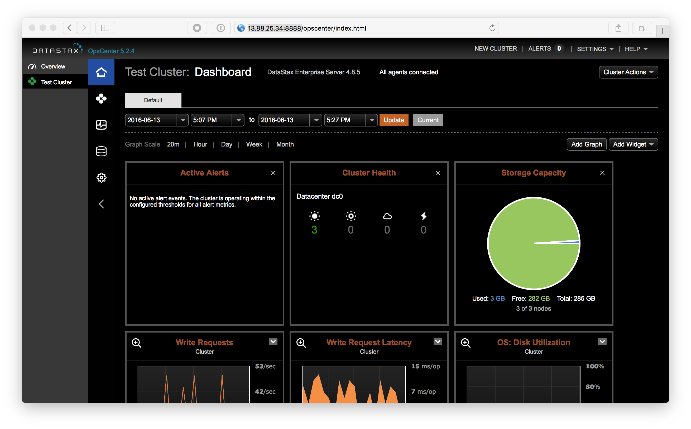
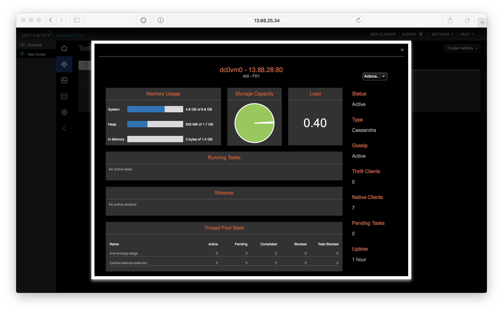
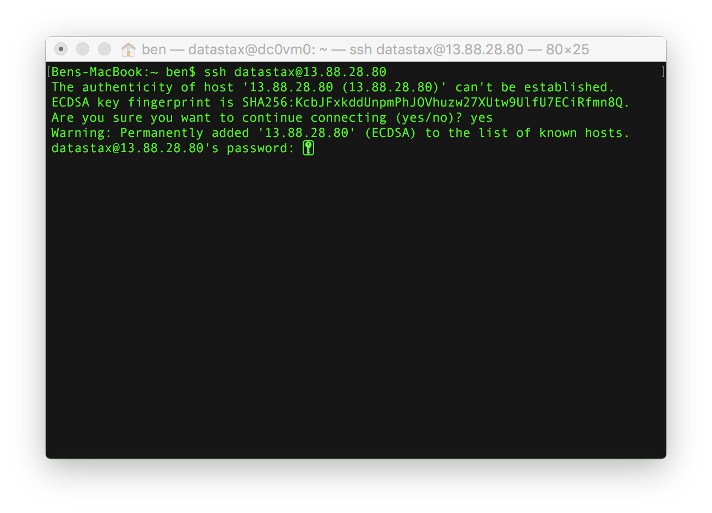
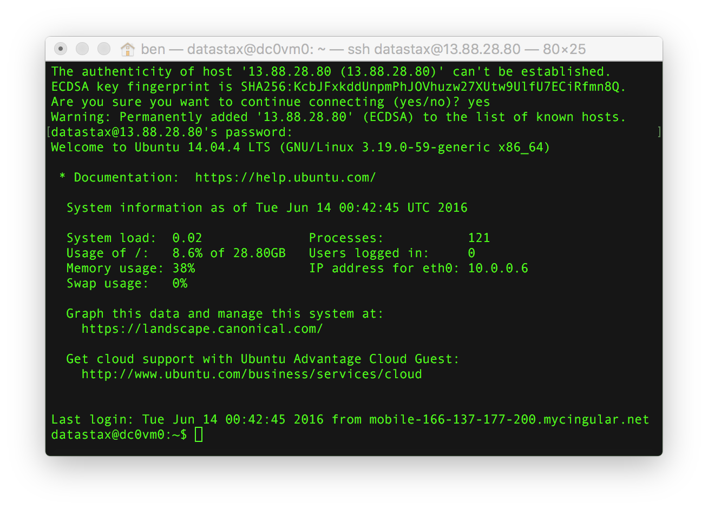
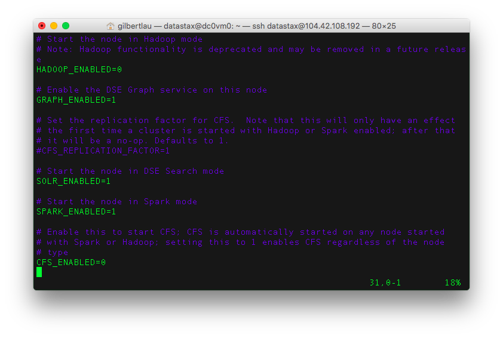
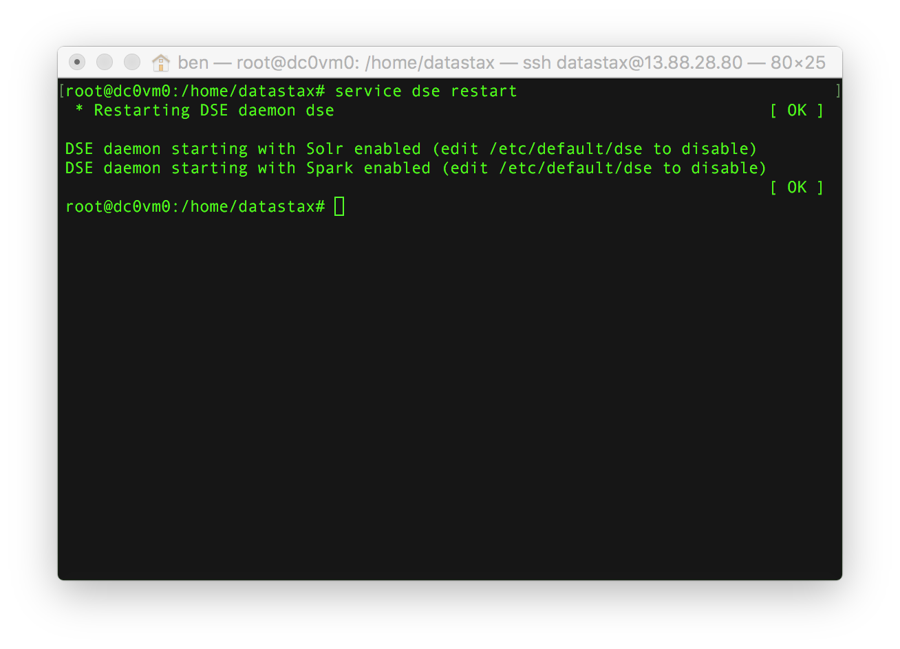
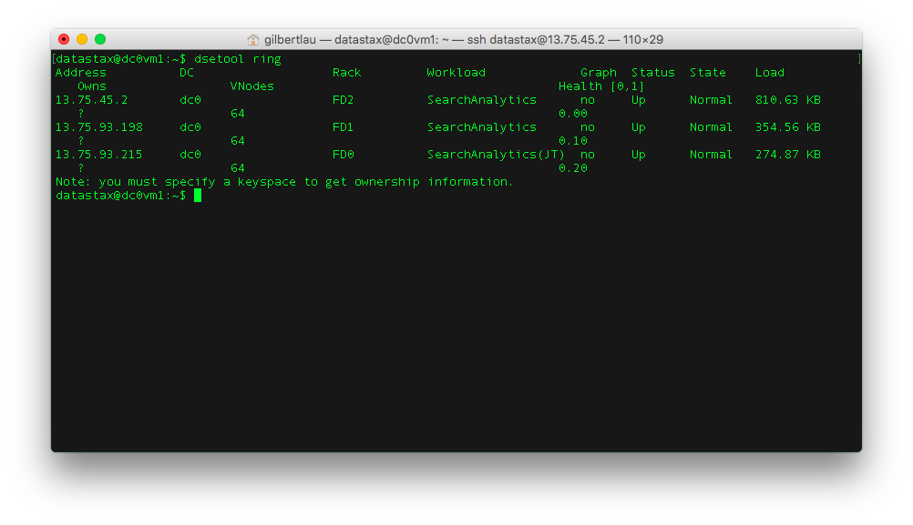
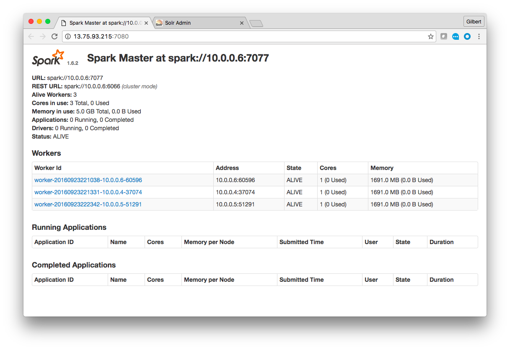
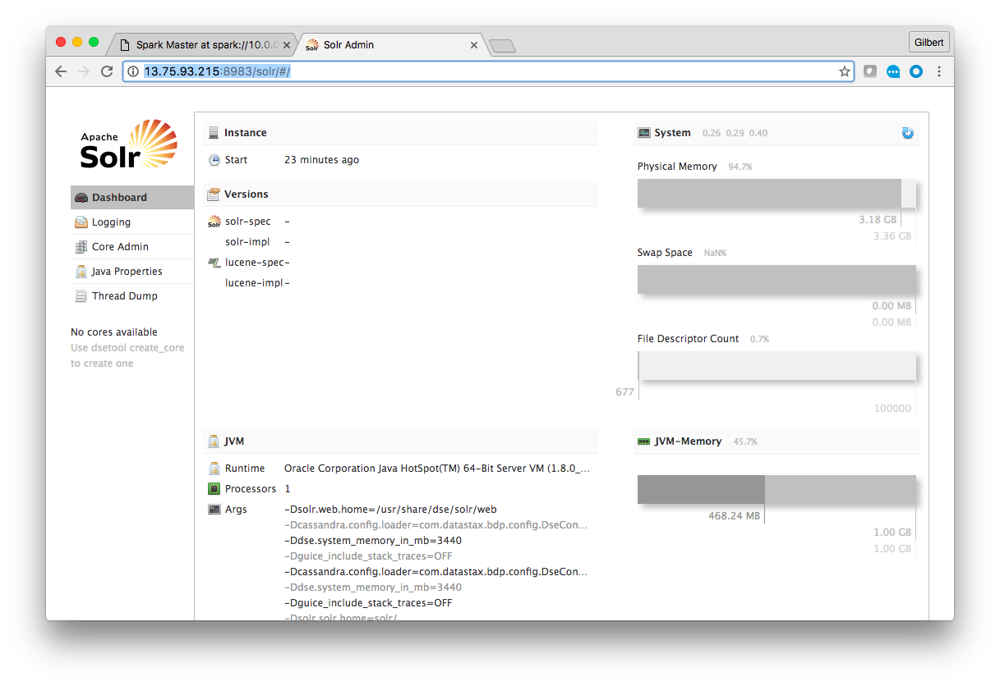

# Lab 1 - Accessing the Cluster

Open a web browser to your OpsCenter node.  If you are using Azure Marketplace, you can find that at [http://portal.azure.com](http://portal.azure.com) at detailed in [Lab 0](./Lab%200%20-%20Provisioning.md).  If you are using a test drive the URL is available there.  OpsCenter runs on port 8888 of the OpsCenter node in Azure.  For this cluster, it's running at http://104.40.53.203:8888.  The URL of your OpsCenter will be different.



Mouse over the nodes in your ring.  There should be three, with the names dc0vm0, dc0vm1 and dc0vm2.  Click on dc0vm0.



Make of note of that node's IP address.  In this case it is 13.88.28.80.  Your IP will be different.  We're now going to SSH into each node and modify a configuration file.  You will have to repeat these steps for nodes dc0vm0, dc0vm1 and dc0vm2.  

If you are on a Mac, you already have SSH installed in your terminal.  If you are on Windows, you may need to install an SSH client.  A popular SSH client is Putty.  Putty can be downloaded from [http://www.putty.org](http://www.putty.org).

For this cluster, the username is datastax.  So, in the terminal I can ssh to the node by running the command:

```
ssh datastax@13.88.28.80
```

You may be prompted to accept the node's key.  If so, type "yes" and hit enter.



Enter your password and hit enter.



Great!  You're now logged into one of your database nodes.  We're going to need to be root to edit files and restart services.  To do that, run the command

```
sudo su
```

Now we're going to use a text editor to change two parameters.  These machines have vi, nano and vim installed.  You can use whichever you prefer.  To edit the file with vi run the command:

```
vi /etc/default/dse
```

In vi you can type "i" to enter insert mode.  When done editing, pressing the escape key will quit insert mode.  To write (save) and quit type ":wq"  vi is a really powerful text editor but has quite a learning curve.  A good getting started guide is [here](https://www.washington.edu/computing/unix/vi.html).  For a more humorous summary, [this](http://www.theregister.co.uk/2003/09/11/bill_joys_greatest_gift/) is a classic.

We want to change two parameter to "1."  Those are:

* GRAPH_ENABLED=1
* SOLR_ENABLED=1
* SPARK_ENABLED=1



We now need to save the file and exit the text editor.  At that point we'll want to restart the DSE service, so that the new parameters are picked up.  We can do that by running the command:

```
service dse restart
```

The service will come back with messages saying that Graph, Spark and Solr are now running as shown below.



*Important* -- Repeat these steps to enable Spark and Solr on nodes dc0vm1 and dc0vm2.

Once complete, you can check all the configs are properly set by running the following command from any node.

```
dsetool ring
```



Each node should say the words "Search" and "Analytics."  If any of them don't, you may have to SSH back into that node and ensure the new configuration is set.

Note that one of the nodes says "(JT)"  This is your Spark job track.  You can view a webpage with information about Spark jobs by opening a web browser to port 7080 on that node.  For this cluster that is at http://13.75.93.215:7080 .  Note your URL will be different.



We also enabled Solr on our nodes.  You can actually view the Solr UI on any node.  However, for our exercises we're going to use dc0vm0.  Open a web browser to port 8983 /solr/ on dc0vm0.  For this cluster that is at http://13.75.93.215:8983/solr .  The URL will be different for your cluster.



Great!  You've now logged into the administrative tool, OpsCenter, on your cluster.  You've also used SSH to connect to each database node in your cluster and used that to turn Spark and Solr on.  Finally you've logged into the administrative interfaces for both Spark and Solr.  Next up we're going to start putting data in the database!

## Optional Exercise

OpsCenter 6 introduced Lifecycle Manager (LCM).  Add the cluster to LCM and then review the settings.  It's possible to enable/disable Spark and Solr in LCM.
