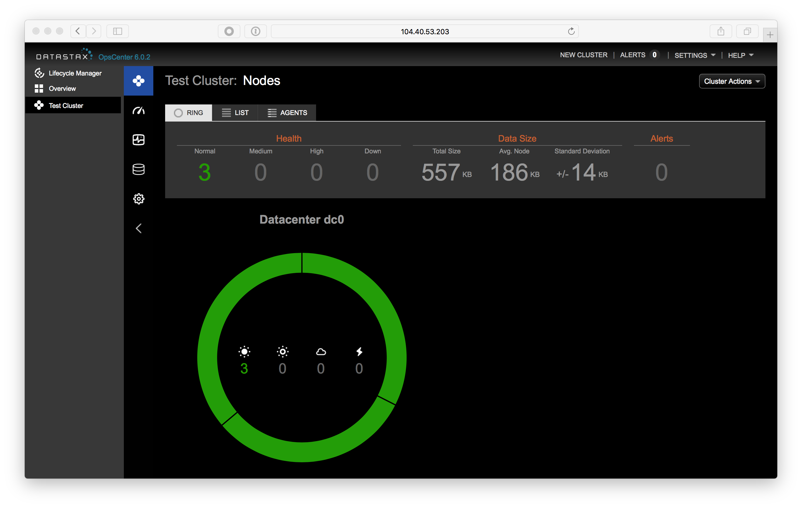

# Lab 1 - Accessing the Cluster

Open a web browser to your OpsCenter node.  If you are using Azure Marketplace, you can find that at [http://portal.azure.com](http://portal.azure.com) at detailed in [Lab 0](./Lab%200%20-%20Provisioning.md).  If you are using a test drive the URL is available there.  OpsCenter runs on port 8888 of the OpsCenter node in Azure.  For this cluster, it's running at http://13.88.25.34:8888.  The URL of your OpsCenter will be different.



Click on the nodes icon below the house icon to see a view of the nodes in your cluster.


Mouse over the nodes in your ring.  There should be three, with the names dc0vm0, dc0vm1 and dc0vm2.  Click on dc0vm0.


Make of note of that node's IP address.  In this case it is 13.88.28.80.  Your IP will be different.  We're now going to SSH into each node and modify a configuration file.  You will have to repeat these steps for nodes dc0vm0, dc0vm1 and dc0vm2.  If you are on a Mac, you already have SSH installed in your terminal.  If you are on Windows, you may need to install an SSH client.  A popular SSH client is Putty.  Putty can be downloaded from [http://www.putty.org](http://www.putty.org).

For this cluster, the username is datastax.  So, in the terminal I can ssh to the node by running the command:

```
ssh datastax@13.88.28.80
```


And before we go on, a quick explanation of what CQL, CQLSH and other aspects of Cassandra and DataStax Enterprise is in order:


Accessing the Cluster
Now we have a 3 node cluster for you to play with! The cluster is initially setup as just a single Cassandra Data Center (DC). We will shortly show you how to set it up as a multi-model mixed-use cluster.  But first, we need to access the cluster. 

Where is my Cluster?
Determine the IP addresses of all of the nodes in your cluster and write them down. You can do this by selecting the Resource Group that you created, then select each of the nodes, one by one. The naming convention for your 3 nodes will likely be: dc0vm0, dc0vm1 and dc0vm2.  You can access the nodes either by their Public IP address or their DNS name. You will also need the Public IP address and DNS name for the opscenter node as well.


To SSH into the cluster:

$ ssh datastax@ip_address 

or

$ ssh datastax@dns_name

You will be using the login and password you entered from the Azure VM creation steps above (e.g. username: datastax, password: C@ssandra).

Search and Analytics Setup
To setup DataStax Enterprise to run both the Search and Analytics integrated components on your cluster, follow these steps on all of your nodes (dc0vmX only, not opscenter):

$ ssh datastax@ip_address

After logging in:

$ sudo vi /etc/default/dse

Change the following:

SOLR_ENABLED=1
SPARK_ENABLED=1

Now save the file. If you need help with “vi”, ask your instructor for assistance. You can also use nano, vim, or any Linux seditor of choice to edit these files.

Now stop and restart the Cassandra server. To begin, you can stop the server by one of two methods:

$ ps auwx | grep cassandra
$ sudo kill pid

or

$ sudo kill -9 $(ps aux | grep dse | awk {'print $2'})

To start Cassandra:

$ sudo service dse start


Accessing DataStax Tools
The following UI's you'll want to play around with.  You will need to determine the proper IP addresses to use. Locate these as follows:

 - OpsCenter: 
-	http://<opscenter ip address>:8888
-	IP address found as the public IP address for the opscenter vm
 - Spark Master: 
-	http://<spark master ip address>:7080
-	IP address found by ssh to any of the dc0vmX nodes, and running the following command (more on dsetool, and what it is later):

$ dsetool status

Note: Ownership information does not include topology, please specify a keyspace.
Address          DC           Rack         Workload                       Status  State      Load                Owns                  VNodes
123.456.1.1    dc0           FD1          SearchAnalytics(JT)      Up        Normal   219.98 KB       34.69%               64
123.456.1.2    dc0           FD2          SearchAnalytics            Up        Normal   12.22 MB         31.12%               64
123.456.1.3    dc0           FD0          SearchAnalytics            Up        Normal   12.36 MB         34.18%               64

-	Look for the (JT) specification under the Workload column. This is the node with the Spark Job Tracker. Use the Public IP address in the command above.
 - Solr UI: http://<solr node ip address>:8983/solr/
-	Use the Public IP address of your dc0vm0 node. This is the node that we will default to using for all subsequent commands with regards to Solr. 

