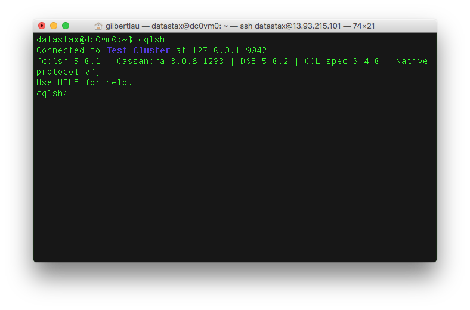
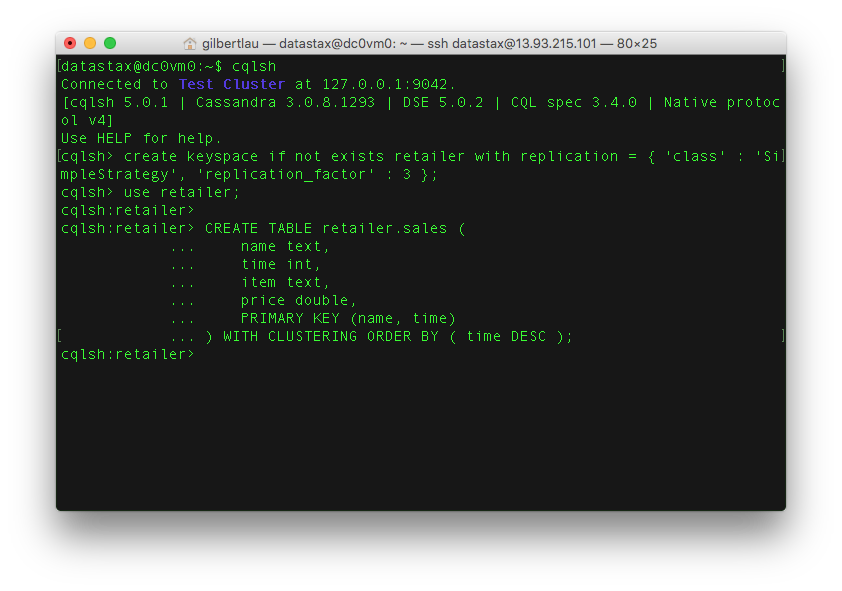
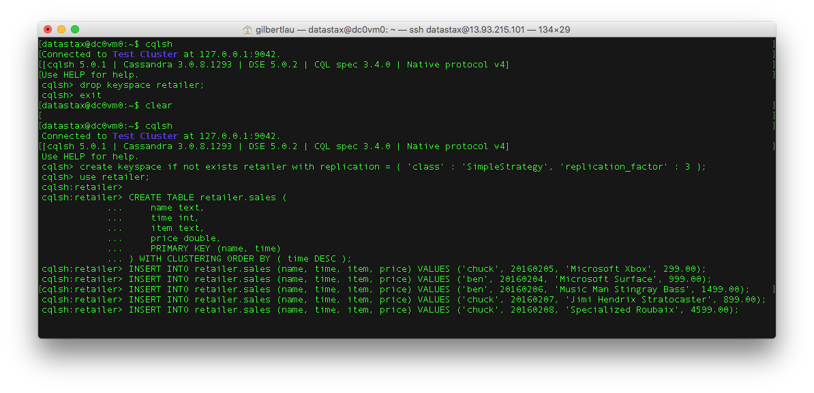
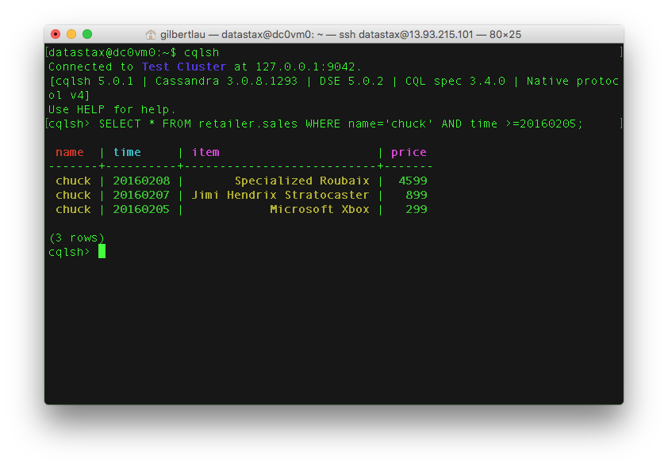

# Lab 2 - CQL

Use SSH to connect to one of your nodes.  We're now going to start the cqlsh client.

And before we go on, a quick explanation of what CQL, CQLSH and other aspects of Cassandra and DataStax Enterprise is in order:

The Cassandra Query Language (CQL) is the primary language for communicating with the Cassandra database. The most basic way to interact with Cassandra is using the CQL shell, cqlsh. Using cqlsh, you can create keyspaces and tables, insert and query tables, plus much more. If you prefer a graphical tool, you can use DataStax DevCenter. For production, DataStax supplies a number of drivers so that CQL statements can be passed from client to cluster and back.

To start the cqlsh client run the command:

```
cqlsh
```



Let's make our first Cassandra Keyspace! If you are using uppercase letters, use double quotes around the keyspace.

```
create keyspace if not exists retailer with replication = { 'class' : 'SimpleStrategy', 'replication_factor' : 3 };
```

And just like that, any data within any table you create under your keyspace will automatically be replicated 3 times. Let's keep going and create ourselves a table. You can follow my example or be a rebel and roll your own.

```
use retailer;

CREATE TABLE retailer.sales (
    name text,
    time int,
    item text,
    price double,
    PRIMARY KEY (name, time)
) WITH CLUSTERING ORDER BY ( time DESC );
```


Yup. This table is very simple but don't worry, we'll play with some more interesting tables in just a minute.

Let's get some data into your table! Cut and paste these inserts into DevCenter or CQLSH. Feel free to insert your own data values, as well.

```
INSERT INTO retailer.sales (name, time, item, price) VALUES ('chuck', 20160205, 'Microsoft Xbox', 299.00);
INSERT INTO retailer.sales (name, time, item, price) VALUES ('ben', 20160204, 'Microsoft Surface', 999.00);
INSERT INTO retailer.sales (name, time, item, price) VALUES ('ben', 20160206, 'Music Man Stingray Bass', 1499.00);
INSERT INTO retailer.sales (name, time, item, price) VALUES ('chuck', 20160207, 'Jimi Hendrix Stratocaster', 899.00);
INSERT INTO retailer.sales (name, time, item, price) VALUES ('chuck', 20160208, 'Specialized Roubaix', 4599.00);
```



Now, to retrieve data from the database run:

```
SELECT * FROM retailer.sales WHERE name='chuck' AND time >=20160205; 
```



See what I did there? You can do range scans on clustering keys! Give it a try.

## Extra Credit

In addition to the command line cqlsh, DataStax offers a product called DevCenter.  You can download DevCenter, connect to your cluster and run queries using that IDE environment.  DevCenter is available for download at [https://academy.datastax.com/downloads](https://academy.datastax.com/downloads).

