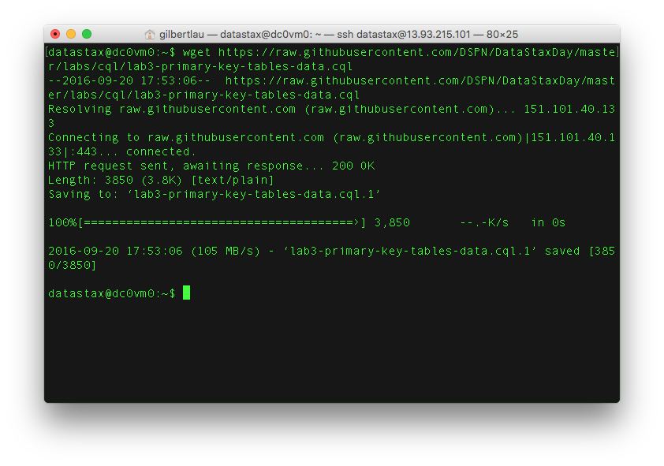

# Lab 3 - Primary Keys

## The secret sauce of the Cassandra data model: Primary Key

There are just a few key concepts you need to know when beginning to data model in Cassandra. But if you want to know the real secret sauce to solving your use cases and getting great performance, then you need to understand how Primary Keys work in Cassandra.

Let's dive in! 

Since Cassandra use cases are typically focused on performance and up-time, it's critical to understand how primary key (PK) definition, query capabilities, and performance are related.

First off, let's use a CQL script to create tables and populate data.  To copy the script off GitHub to one of your nodes run the command:

```
wget https://raw.githubusercontent.com/DSPN/DataStaxDay/master/labs/cql/lab3-primary-key-tables-data.cql
```



Take a look at the file in your favorite text editor, for instance using vi by running the command:

```
vi lab3-primary-key-tables-data.cql
```


You'll notice all tables are exactly the same except for the primary key definition.

Now let's run the cql script.  To do so, start cqlsh by running:

```
cqlsh
```


Now we can source the script to run it with the command:

```
source 'lab3-primary-key-tables-data.cql'
```


Great!  Now we have some data loaded up that we can take a look at.  Let's try running some queries.

The CQL file here contains five different sets of queries [./cql/lab3-primary-key-queries.cql](./cql/lab3-primary-key-queries.cql).

For one table at a time, copy/paste/run the groups of queries. In other words, run all of the queries for sentiment1 at the same time. Check out Cassandra's response. Then run all queries for sentiment2 at the same time, etc. You'll notice that some of the queries work against some of the tables, but not all. Why?

## Extra Credit 1

Did this query work for any of the tables?  Why or why not?  (sentimentX below = sentiment1, sentiment2, ... or sentiment5 in lab3-primary-key-queries.cql)

```
select * from sentimentX where ch = 'facebook' and dt >= 20160102 and dt <= 20160103;
```

## Extra Credit 2

What would you do if you needed to find all messages with positive sentiment?

## Challenge Question

In the real world, how many tweets would you guess occur per day? As of this writing, Twitter generates ~500M tweets/day according to these guys, Internet Live Stats: http://www.internetlivestats.com/twitter-statistics/

Let's say we need to run a query that captures all tweets over a specified range of time. Given our data model scenario, we simply data model a primary key value of (ch, dt) to capture all tweets in a single Cassandra row sorted in order of time, right? Easy! But, alas, the Cassandra logical limit of single row size (2B columns in C* v2.1) would fill up after about 4 days. Ack! Our primary key won't work. What would we do to solve our query?

## Cassandra Data Model and Query Pro-Tips

Here are a few Cassandra data modeling pro-tips and principles to stay out of trouble and get you moving the right direction:

### Primary Keys

Know what a partition key is. Know what a clustering key is. Know how they work for storing the data and for allowing query functionality. This exercise is a great start.

### Secondary Indexes

If you're tempted to use a secondary index in Cassandra in production, at least in Cassandra 2.1, don't do it. Instead, create a new table with a PK definition that will meet your query needs. In Cassandra, denormalization is fast and scalable. Secondary indexes aren't as much. Why? Lots of reason that have to do with the fact that Cassandra is a distributed system. It's a good thing.

### Materialized Views

In Cassandra 3.0 and later, a materialized view is a table that is built from another table's data with a new primary key and new properties. In Cassandra, queries are optimized by primary key definition. Standard practice is to create the table for the query, and create a new table if a different query is needed.  A materialized view automatically receives the updates from its source table.  

Secondary indexes are suited for low cardinality data. Queries of high cardinality columns on secondary indexes mentioned above require Cassandra to access all nodes in a cluster, causing high read latency.  While materialized views are suited for high cardinality data. The data in a materialized view is arranged serially based on the view's primary key. 

### Relational Data Models

Relational data models don't work well (or at all) in Cassandra. That's a good thing, because Cassandra avoids the extra overhead involved in processing relational operations. It's part of what makes Cassandra fast and scalable. It also means you should not copy your relational tables to Cassandra if you're migrating a relational system to Cassandra. Use a well-designed Cassandra data model.

### Joins

Cassandra doesn't support joins. How do you create M:1 and M:M relations? Easy... denormalize your data model and use a PK definition that works. Think in materialized views. Denormalization is often a no-no in relational systems. To get 100% up-time, massive scale/throughput and speed that Cassandra delivers, it's the right way to go.

### Allow Filtering

If you're tempted to use Allow Filtering in production, see the advice for Secondary Indexes above.

### Batches 

Batches solve a different problem in Cassandra than they do in relational databases. Use them to get an atomic operation for a single PK across multiple tables. Do NOT use them to batch large numbers of operations assuming Cassandra will optimize the query performance of the batch. It doesn't work that way. Use batches appropriately or not at all.

## Conclusion

Feel free to reach out if you have any Cassandra data modeling questions. The DataStax documentation is also a great resource: http://docs.datastax.com/en/landing_page/doc/landing_page/current.html

