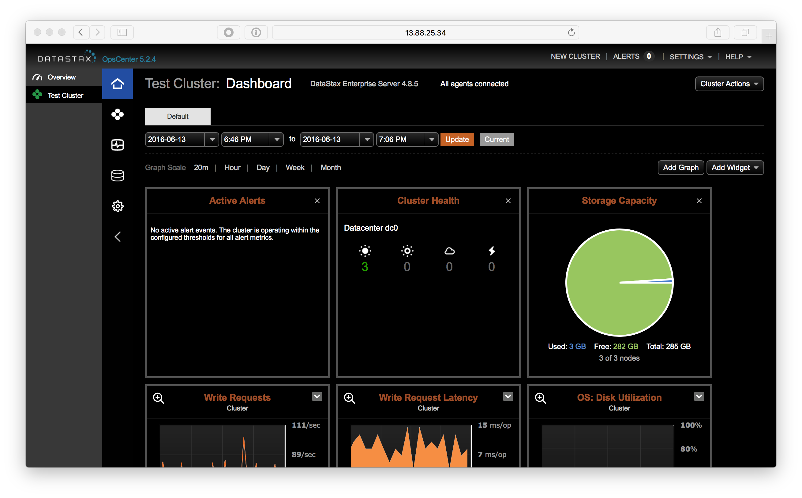
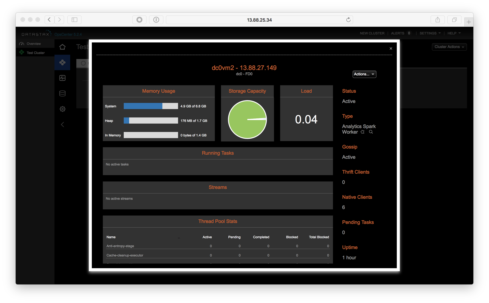
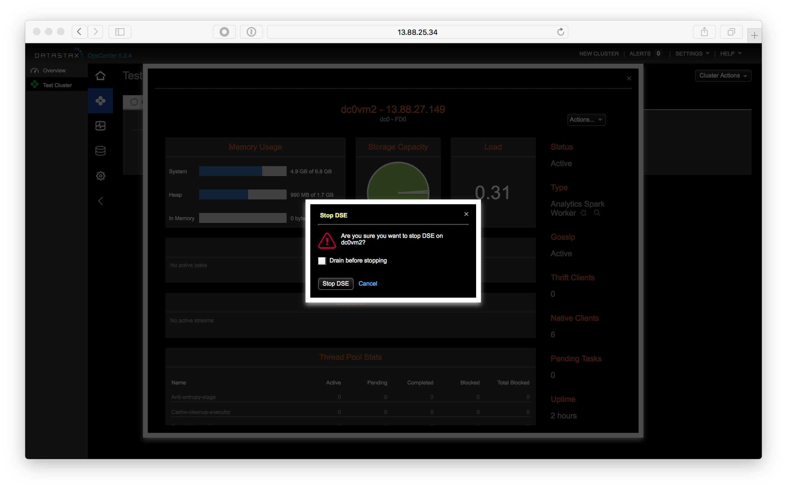
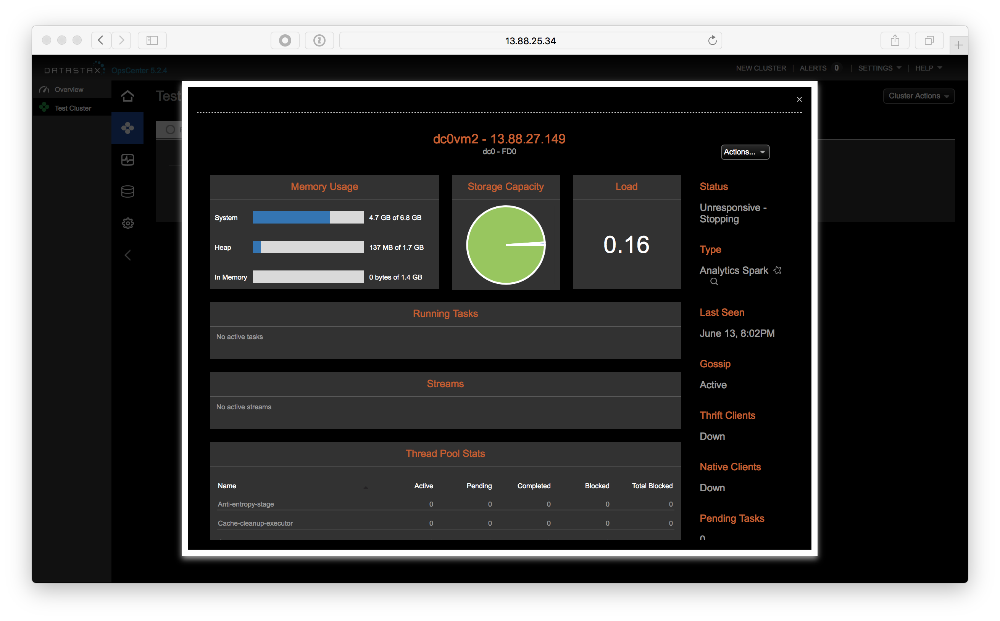
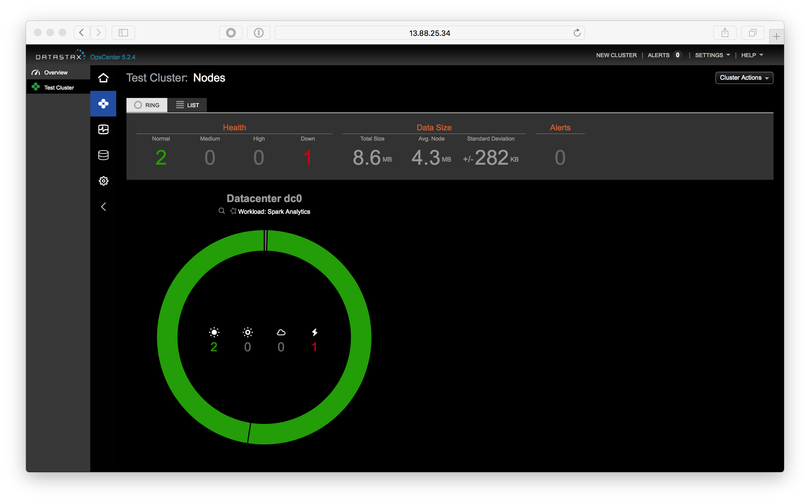
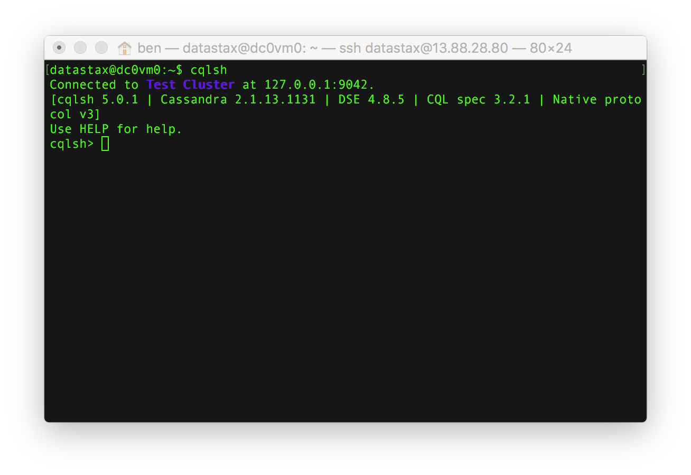
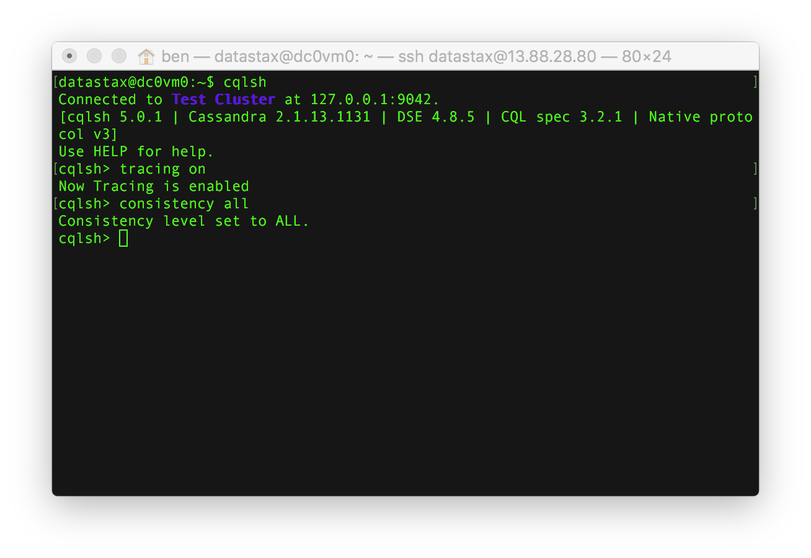

# Lab 4 - Consistency

Let's play with consistency!

Consistency in Cassandra refers to the number of acknowledgements replica nodes need to send to the coordinator for an operation to be successful while also providing good data (avoiding dirty reads).

We recommend a default replication factor of 3 and consistency level of LOCAL_QUORUM as a starting point. You will almost always get the performance you need with these default settings.

In some cases, developers find Cassandra's replication fast enough to warrant lower consistency for even better latency SLA's. For cases where very strong global consistency is required, possibly across data centers in real time, a developer can trade latency for a higher consistency level.

Let's give it a shot.

## This DeathStar is Operational!

First, we will shutdown one of the nodes so you can see the [CAP theorem](https://en.wikipedia.org/wiki/CAP_theorem) in action. Go to your browser, and access OpsCenter at http://opscenter_ip_address:8888



Click on the nodes icon (below the house icon).


Now, select one of the nodes and click on it:



Finally, choose the Actions... drop down and select Stop:



Click "Stop DSE"



In the node ring view you should now see one node down.



At a command prompt on a node that is still running start cqlsh by running the command:

```
cqlsh
```



Now, in the cqlsh, run the commands:

```
tracing on
consistency all
```



Any query will now be traced. Consistency of all means all 3 replicas need to respond to a given request (read OR write) to be successful. Let's do a SELECT statement in cqlsh to see the effects.

```
SELECT * FROM retailer.sales where name='chuck';
```

Note that the query fails.  Why did it fail?  Next we're going to change the consistency level to make our query succeed.  Let's compare a lower consistency level: 

```
consistency local_quorum
SELECT * FROM retailer.sales where name='chuck';
```

In this case, be sure to take note of the time the query took to complete.  Quorum means majority: RF/2 + 1. In our case, 3/2 = 1 + 1 = 2. At least 2 nodes need to acknowledge the request.

Let's try the SELECT statement again.

```
consistency local_one
SELECT * FROM retailer.sales where name='chuck';
```

Take a look at the trace output. Look at all queries and contact points. What you're witnessing is both the beauty and challenge of distributed systems.

```
consistency local_quorum
SELECT * FROM retailer.sales where name='chuck';
```

This looks much better now doesn't it? LOCAL_QUORUM is the most commonly used consistency level among developers. It provides a good level of performance and a moderate amount of consistency. That being said, many use cases can warrant CL=LOCAL_ONE.

For more detailed classed on data modeling, consistency, and Cassandra 101, check out the free classes at the DataStax Academy website: https://academy.datastax.com

When complete with the exercise, go back to OpsCenter and start the node you disabled again.

