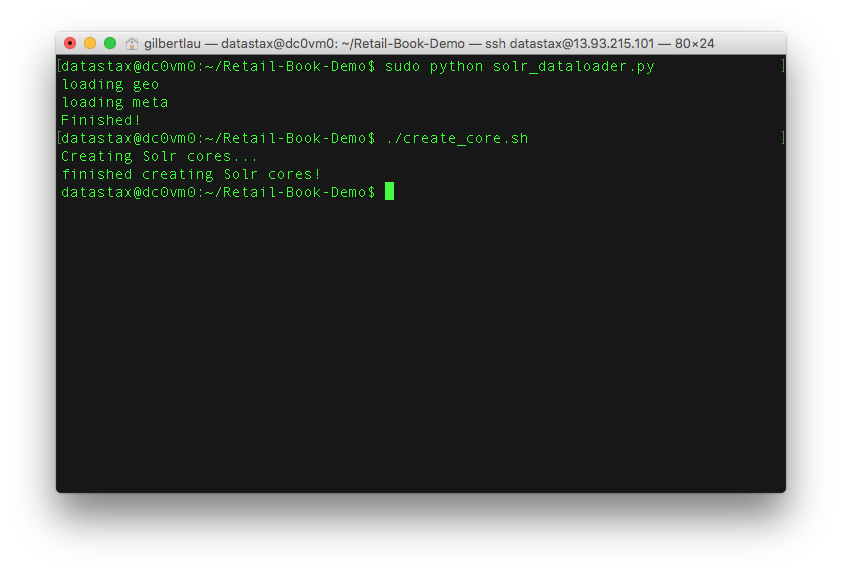

# Lab 5 - Search

## Search Essentials

DSE Search is awesome. You can configure which columns of which Cassandra tables you'd like indexed in Lucene format to make extended searches more efficient while enabling features such as text search and geospatial search.

Let's start off by indexing the tables we've already made. Here's where the dsetool really comes in handy.  From the command line on one of your nodes run:

```
dsetool create_core retailer.sales generateResources=true reindex=true
```


If you've ever created your own Solr cluster, you know you need to create the core and upload a schema and config.xml. That generateResources tag does that for you. For production use, you'll want to take the resources and edit them to your needs but it does save you a few steps.

Now for that description of the dsetool. Use the dsetool utility for creating system keys, encrypting sensitive configuration, and performing Cassandra File System (CFS) and Hadoop-related tasks, such as checking the CFS, and listing node subranges of data in a keyspace.

This by default will map Cassandra types to Solr types for you. Anyone familiar with Solr knows that there's a REST API for querying data. In DSE Search, we embed that into CQL so you can take advantage of all the goodness CQL brings. Let's give it a shot.  Inside a cqlsh run the command:

```
SELECT * FROM retailer.sales WHERE solr_query='{"q":"name:*"}';
```


```
SELECT * FROM retailer.sales WHERE solr_query='{"q":"name:chuck", "fq":"item:*icrosof*"}';
```


For your reference, here's the doc that shows some of things you can do: http://docs.datastax.com/en/latest-dse/datastax_enterprise/srch/queriesCql.html

## Retail Book Workshop

Ok! Time to work with some more interesting data. Meet the Retail book sales data: https://github.com/chudro/Retail-Book-Demo

First, you’ll need to set this up within your Azure Instances. Pick your dc0vm0 node and log into it.  Now run a few commands to set up the Cassandra Python driver and make a local copy of the Retail Book Demo.  This will take a few minutes to run.

```
sudo apt-get -y install python-pip
sudo apt-get -y install build-essential python-dev
sudo apt-get -y install libev4 libev-dev
sudo pip install cassandra-driver
sudo apt-get -y install git
git clone -b patch-1 https://github.com/gmflau/Retail-Book-Demo
cd Retail-Book-Demo/
```


Great!  Now that is all installed, check what your 10.0.0.x private address is using the command:

```
ifconfig
```


For this node the address is 10.0.0.5.  Yours may be different.  Now we're going to edit the solr_dataloader.py file.

```
sudo vi solr_dataloader.py
```

Change the line cluster = Cluster(['node0','node1','node2']) to cluster = Cluster(['10.0.0.x’])


Now run the data loader and then create a solr core on top of the new data.

```
sudo python solr_dataloader.py
./create_core.sh
```



Here's an example page of what's in the database now: https://www.amazon.com/Science-Closer-Look-Grade-6/dp/0022841393?ie=UTF8&keywords=0022841393&qid=1454964627&ref_=sr_1_1&sr=8-1

Now that we've prepared all that, what can we do?  Lots of things it turns out...

## Filter queries

These are awesome because the result set gets cached in memory.

```
SELECT * FROM retailer.metadata WHERE solr_query='{"q":"title:Noir~", "fq":"categories:Books", "sort":"title asc"}' limit 10; 
```

## Faceting

Get counts of fields

```
SELECT * FROM retailer.metadata WHERE solr_query='{"q":"title:Noir~", "facet":{"field":"categories"}}' limit 10; 
```

## Geospatial Searches

Supports box and radius

```
SELECT * FROM retailer.clicks WHERE solr_query='{"q":"asin:*", "fq":"+{!geofilt pt=\"37.7484,-122.4156\" sfield=location d=1}"}' limit 10; 
```

For more info, check out: https://cwiki.apache.org/confluence/display/solr/Spatial+Search

## Joins

Not your relational joins. These queries 'borrow' indexes from other tables to add filter logic. These are fast!

```
SELECT * FROM retailer.metadata WHERE solr_query='{"q":"*:*", "fq":"{!join from=asin to=asin force=true fromIndex=retailer.clicks}area_code:415"}' limit 5; 
```

Fun all in one.

```
SELECT * FROM retailer.metadata WHERE solr_query='{"q":"*:*", "facet":{"field":"categories"}, "fq":"{!join from=asin to=asin force=true fromIndex=retailer.clicks}area_code:415"}' limit 5;
```

Want to see a really cool example of a search application?  Check out: https://github.com/LukeTillman/killrvideo-csharp

