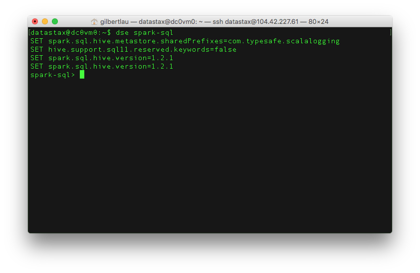
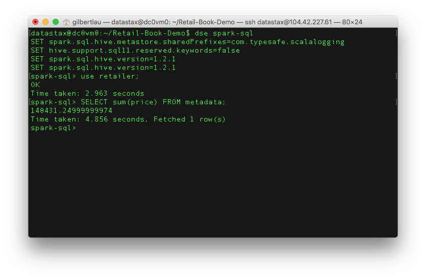

# Lab 6 - Analytics

[Apache Spark](http://spark.apache.org/) is a general purpose data processing engine built in the functional programming language Scala.  It's one of the hottest things in industry today and a great skill to pick up.  Spark supports both batch and streaming (which is actually a micro batch). Batch includes both data crunching code and SparkSQL,  Streaming is the processing of incoming data (in micro batches) before it gets written to a data store, in our case Cassandra.  Spark even includes a machine learning library called [Spark MLlib](http://spark.apache.org/mllib/).

If you're interested in dissecting a full scale streaming app, check out this git: https://github.com/retroryan/SparkAtScale

Spark has a REPL we can play in. To make things easy, we'll use the SQL REPL::

```
dse spark-sql
```



Now we can try some SQL commands.  Note that this is SQL, not CQL.

```
use retailer; 
SELECT sum(price) FROM metadata;
```



We can give a variety of more complex queries such as:

```
SELECT m.title, c.city FROM metadata m JOIN clicks c ON m.asin=c.asin;
SELECT asin, sum(price) AS max_price FROM metadata GROUP BY asin ORDER BY max_price DESC limit 1;
```

If you want to learn more about Spark, DataBricks, has some great training on it at https://databricks.com/spark/training  Learning about Scala can be helpful as well and there's an amazing course on it available at http://coursera.org/learn/progfun1

