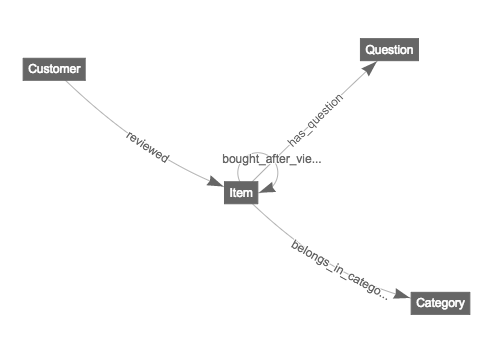

# Lab 7 - Graph

DataStax Enterprise Graph (DSE Graph) is the first graph database fast enough to power customer facing applications, capable of scaling to massive datasets and advanced integrated tools capable of powering deep analytical queries. Because all of DataStax Enterprise is built on the core architecture of Apache Cassandra™, DataStax Enterprise Graph can scale to billions of objects, spanning hundreds of machines across multiple datacenters with no single point of failure.

If you're interested in learning more about the benefits of DSE Graph, you can visit this [link](https://docs.datastax.com/en/latest-dse/datastax_enterprise/graph/dseGraphAbout.html).

In this lab, we are going to get you some hands on experience with DSE Graph. It includes schemas, data, and mapper script for the DataStax Graph Loader.

#### Prerequisites:

- DataStax Graph Loader
- DataStax Enterprise 5.0.2
- DataStax Studio 1.0.1
- Download the data for our graph

#### You can simply follow the instructions below for the entire lab exercise.

##### Preparation

Log into any of your DataStax Cassandra nodes via SSH, change to your home directory, and install "git"
```
ssh datastax@<ip address of your Cassandra node>
cd ~
sudo apt-get install -y git
mkdir DSE_Graph
```

##### Download a GitHub project at https:\/\/github.com/Marcinthecloud/DSE-Graph-For-Fun for this lab
```
cd ~/DSE_Graph
git clone https://github.com/Marcinthecloud/DSE-Graph-For-Fun
```

##### Install DataStax Loader
```
cd ~/DSE_Graph
wget https://s3-us-west-2.amazonaws.com/datastax-day/dse-graph-loader-5.0.1-bin.tar.gz
tar -xzvf dse-graph-loader-5.0.1-bin.tar.gz
cd dse-graph-loader-5.0.1
wget https://s3-us-west-2.amazonaws.com/datastax-day/dse-graph-loader-5.0.0-rc1-SNAPSHOT-uberjar.jar
mv dse-graph-loader-5.0.0-rc1-SNAPSHOT-uberjar.jar dse-graph-loader-5.0.1-uberjar.jar
```

##### Intall and configure DataStax Studio

```
cd ~/DSE_Graph
wget https://s3-us-west-2.amazonaws.com/datastax-day/datastax-studio-1.0.1.tar.gz
tar -xzvf datastax-studio-1.0.1.tar.gz
```

Edit the configuration.yaml file in your \<DataStax Studio Install Directory\>/conf to update the httpBindAddress to your VM instance's private 10.x.x.x address


<br>
Then start your DataStax Studio

```
cd <datastax studio install directory>
bin/server.sh
```

##### Use DataStax Studio to create schema and run Gremlin queries

Open your local browser at http://\<public_ip of your Cassandra node\>:9091 and create a connection to create your graph database as follows:


```
Fill out the "CREATE CONNECTION" form as follows:
-------------------------------------------------
Host / IP: Enter your connected Cassandra node's public IP address
Port: Enter 9042
Graph Name: Enter "product_graph"
```


Click “Test” to verify if it can connect to your Cassandra database.  If connected successfully, click “Save” and click “Yes” to create the “product_graph” database.

Now, open a new Notebook by clicking the “+” sign.  Assign a meaningful name for your Notebook and select the connection you created in previous step.  Then click “Create”.


Run Gremlin to create the graph schema:

Copy and paste from schema.groovy under "DSE-Graph-For-Fun git project install directory" into your DataStax Studio's Gremlin box as shown below.


Click the real-time play button to execute. When it finishes, hit the schema button at the top right of Studio.  It should look like the following graph diagram.




##### Download the required data files and load them into your graph database
```
cd ~/DSE_Graph
cd <datastax loader install directory>
wget https://s3-us-west-2.amazonaws.com/datastax-day/meta.json.gz
wget https://s3-us-west-2.amazonaws.com/datastax-day/qa.json.gz
wget https://s3-us-west-2.amazonaws.com/datastax-day/reviews.json.gz
```

We need to modify data_mapper.groovy to point to your data files locally
```
cd <DSE_Graph/DSE-Graph-For-Fun git project directory>
```

Edit the following three lines in data_mapper.groovy file to point to your data files
```
// data file paths
list_of_review_data_paths = ['/path/to/reviews.json.gz']
list_of_review_data_paths = ['/path/to/reviews.json.gz']
list_of_metadata_paths = ['/path/to/meta.json.gz']
```
In my environemnt, they are:
```
// data file paths
list_of_review_data_paths = ['/home/datastax/DSE_Graph/reviews.json.gz']
list_of_metadata_paths = ['/home/datastax/DSE_Graph/meta.json.gz']
list_of_q_and_a_data_paths = ['/home/datastax/DSE_Graph/qa.json.gz']
```

Now, let's load the data into your graph database
```
cd <DSE graph loader install directory>
./graphloader <DSE_Graph/DSE-Graph-For-Fun git project directory>/data_mapper.groovy -graph product_graph -address localhost
```
This process will take approximately ten minutes.


##### Now, we are ready to run some queries.

Let's run a very broad query to return all vertices.  Remember that Studio truncates results to 1000 by default.
```
g.V()
```


Now, let's run a more refined query to retrieve reviews of all product items.

```
g.V().outE('reviewed')
```


Next, let's find out how many items have the word "awesome" in their description.  Run the following Gremlin query:

```
g.V().has('Item','description', Search.tokenRegex('awesome')).count()
```


Finally, let's try a simple recommendation style traversal.  We will start at certain 'Customer'.  We will then go out to the items he/she has reviewed. Then we come back to find other customers who have also reviewed that product.  Run the following Gremlin query:
```
g.V().has('Customer', 'customerId', 'A1YS9MDZP93857').as('customer').out('reviewed').aggregate('asin').in('reviewed').where(neq('customer')).dedup().values('name').limit(10)
```


